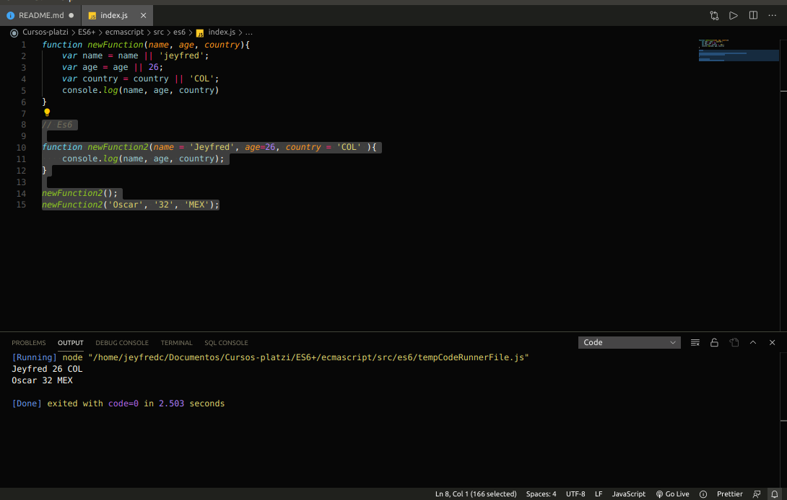

# ES6+

[Default Params y Concatenación](#Default-Params-y-Concatenación)

[LET y CONST, Multilínea, Spread Operator y Desestructuración](#LET-y-CONST-Multilínea-Spread-Operator-y-Desestructuración)

[Arrow Functions, Promesas y Parámetros en objetos](Arrow-Functions-Promesas-y-Parámetros-en-objetos)

[Clases, Módulos y Generadores](#Clases-Módulos-y-Generadores)

Entender que modificaciones se han realizado en cada una de las versiones de la especificacion de Ecma Script la cual pertenece a estandares que ha desarrollado Ecma International, la cual es una institucion encargada de los estandares. JavaScript es el lenguaje de programacion que utiliza la especificacion Ecma Script para trabajar sobre las caracteristicas que van siendo añadidas año con año a partir del 2015 que fue lanzada la version 6, despues de que lanzaron la version 6 empezo a salir ES7, ES8, ES9, etc.

**Nota:** cada version lanza nuevas caracteristicas y generalmente es lanzada en el mes de junio año tras año 

## Default Params y Concatenación

Lo primero a realizar es abrir la consola o terminal y crear una carpeta que se llame ecmacript ya sea con el comando mkdir ecmascript o creandola directamente en el editor de codigo **VsCode**

luego ubicar la carpeta en la terminal, ejecutar el comando `git init` y despues el comando `npm init` y luego ejecutar todo como esta en la siguiente imagen


luego dentro de la carpeta **ecmascript** crear una carpeta que se llame **src** y dentro de esta crear otra carpeta que se llame **es6** y dentro de esta crear un archivo que se llame **index.js**

Una de las caracteristicas añadidas a Es6 son los **parametros por defecto**, lo que significa es que se pueden establecer valores que se pasan a una funcion por defecto 

A continuacion un ejemplo de como se hacia antes de que existiera Es6

se creaba la funcion asignando parametros como nombre, edad y pais y luego con var y el nombre de la variable se empezaban a establecer los parametros

```
function newFunction(name, age, country){
    var name = name || 'jeyfred';
    var age = age || 26;
    var country = country || 'COL';
    console.log(name, age, country)
}
```

Con el nuevo estandar ahora se puede establecer desde la asignacion de los parametros 

```
// Es6

function newFunction2(name = 'Jeyfred', age=26, country = 'COL' ){
    console.log(name, age, country);
}
```

para hacer el llamado de la funcion se podria hacer de 2 formas.

La primera es simplemente con 

`newFunction2();`

De esta forma va a traer los datos que se pasaron en los parametros de la funcion

La otra forma es pasando otro tipo de valor por parametros

`newFunction2('Oscar', '32', 'MEX');`

para poder ejecutar sin necesidad de usar el navegador con **ctrl+shift+x** se puede utilizar las extensiones de **VsCode** y en el buscador buscar **Code Runner**


lo que se debe hacer a continuacion es seleccionar el bloque de codigo que se quiere ejecutar, dar click derecho y luego seleccionar **Run Code**


A continuacion lo que va a pasar es que se va a abrir una terminal en **VsCode** ejecutando el codigo



___

**Templates literals**

Permiten separar o unir varios elementos

primero se va a realizar el ejemplo con el estandar antiguo, se declaraban variables con string y para poder concatenar se utilizaba el simbolo + unas comillas con un espacio y otro + para concatenar palabras

```
let hello = "Hello";
let world = "World";
let epicPhrase = hello + ' ' + world;
console.log(epicPhrase);
```

De esta forma era como anteriormente se concatenaba


Ahora con los template literal es mucho mas facil concatenar palabras, se le denomina asi a estas comillas **``** francesas generalmente no se encuentran en la misma posicion en todos los teclados y depende en que idioma este configurado el teclado.
despues se utiliza el signo `$` y los corchetes `{}` para pasar las variables dentro de estos. De esta forma

```
// Es6 
let epicPhrase2 = `${hello} ${world}`;
console.log(epicPhrase2);
```


## LET y CONST, Multilínea, Spread Operator y Desestructuración

Otra de las cosas que cambia con ES6 es el multilinea es decir escribir palabras a traves de una variable y lo que antiguamente se hacia para hacer un salto de linea era colocar lo siguiente `\n` y luego concatenar con el signo `+` aqui un ejemplo.

```
let lorem = "Lorem Ipsum has been the industry's standard dummy \n"
+ "text ever since the 1500s,\n"
```

Ahora con ES6 se puede hacer uso de los template literals **``** y saltar de linea con dar un enter en el codigo de la siguiente forma

```
//Es6
let lorem2 = `Esta es la primer linea de texto y ahora voy a pasar
a segunda linea de texto generada para lorem2

ahora pase a la cuarta linea`
```

Luego de esto se hace un `console.log` de cada una de las variables


___

Ahora viene la desestructuración para esto se crea un objeto con una variable que se llame `person` la cual va a tener 3 elementos op atributos que van a ser el nombre, la edad y el pais y luego para acceder a cada uno de los elementos con `console.log` se llama al atributo o propiedad de `person` asi `(person.name, person.age, person.country)`.

```
let person = {
    'name' : 'Jeyfred',
    'age' : 26,
    'country' : 'COL',

}
console.log(person.name, person.age, person.country);
```

Con Es6 se debe crear una constante de esta forma `let { name, age, country} = person;` y luego nuevamentecon console.log llamar a cada uno de los atributos directamete `console.log(name, age, country);` si se quiere quitar algun atributo como age o country se debe eliminar de la constante y de `console.log`

```
//Es6
let { name, age, country} = person;
console.log(name, age, country);
```


___

El operador de propagacion ayuda a unir elementos como por ejemplo arrays o arreglos. este operador esta representado en el codigo con `...variable`, aqui un ejemplo de como se haria de la forma anterior para unir elementos

```
let team1 = ['Jeyfred' , 'Valeria', 'Juan']

let team2 = ['Oscar', 'Julian', 'Daniela']

let education = ['David', 'Jeyfred' , 'Valeria', 'Juan' , 'Oscar', 'Julian', 'Daniela']

console.log(education)
```

Con Es6 por medio de este llamado se pueden unir los elementos de manera mas simple

```
//Es6
let education = ['David', ...team1, ...team2]

console.log(education)
```


___

**Nota:** A partir de Es6 ya no se usa la palabra **var** para declarar variables porque al declarar una variable esta estaba disponible de forma global.

Con la palabra **let** solo esta disponible en el Scope, es decir en el bloque de codigo que va a ser llamado

por ejemplo aqui se va a declarar una variable con la palabra var y luego la palabra let

```
{
    var globalVar = "Global Var";
}

{
    let globalLet = "Global Let";
}

console.log(globalVar);

console.log(globalLet);

```

Al hacer `console.log`, solo esta disponible la palabra Global Var, porque esta en el scope global, pero Global Let no se encuentra disponible porque solo funciona dentro del bloque de codigo


Para poder imprimir la otra palabra, se debe declarar console.log dentro del bloque asi

```
{
    var globalVar = "Global Var";
}

{
    let globalLet = "Global Let";
    console.log(globalLet);
}

console.log(globalVar);

```


___

Otra de las cosas que cambia Es6 es la asignacion de variables, por ejemplo con la palabra **var** se podia asignar valores cuantas veces quisiera asi y al final imprimir el ultimo valor asignado a una variable

```
var a = "hello world";
var a = 123456;
var a = "hello world123456";

console.log(a);
```


Ahora con Es6 y la palabra reservada `const` ya no es posible re asignar una variable que este declarada y por tanto se va a imprimir un error

```
var a = "hello world";
var a = 123456;
var a = "hello world123456";

console.log(a);
```


## Arrow Functions, Promesas y Parámetros en objetos

Anteriormente para crear un objeto se debe acceder a la variable y a la propiedad de esta forma

```
let name = "Jeyfred";
let age = 26;

obj = {name: name , age:age}

console.log(obj)
```

Con Es6 se permite ahorrar un poco mas de codigo para acceder al objeto de la siguiente forma

```
let name = "Jeyfred";
let age = 26;
//Es6
obj2 = {name , age};

console.log(obj2);
```


___

### Arrow Functions(Funciones de tipo flecha)

Las Arrow Fucntions son funciones anonimas en Es5 se usaban para iterar sobre objetos en un arreglo y poder presentar o obtener los datos para esto se tenia que usar el metodo `Map` y lo que va dentro de los parentesis son las **Arrow Functions** o funciones anonimas

```
let names = [
    { name: 'Jeyfred', age: 26},
    { name: 'Tatiana', age: 23},
]

let listOfNames = names.map(function(item){
    console.log(item.name);
})
```

Con Es6 en vez de pasar directamente la funcion anonima se va a esteblecer el iterador el cual seria `item` y mediante `=>` ya se establece que es una funcion anonima 

```
let names = [
    { name: 'Jeyfred', age: 26},
    { name: 'Tatiana', age: 23},
]

let listOfNames2 = names.map(item => console.log(item.name));
```

y esta seria una tercer forma de obtener los valores

```
let names = [
    { name: 'Jeyfred', age: 26},
    { name: 'Tatiana', age: 23},
]

let listOfNames3 = names.map(({name, age}) => console.log(name, age));
```


___

### Promises (Promesas)

Con estas se trabaja lo que es el asincronismo, quiere decir que va a ejecutar elemento por elemento y solucionar un problema en los **callback** al cual le llamaba **callback hell**, era ejecutar llamados en cascada y anidacion de muchos elemetos que hacia mas dificil leer el codigo.

Las promesas lo que inidican es que algo va a suceder, segun lo asigne la persona que esta programando, ahora mediante una **arrow function** se establece la promesa, estas utilizan tambien dos metodos que son **resolve** o **reject**, es decir resuelve o rechaza, en el caso de que sea cierto imprime `'Hey, todo salio bien'` y en caso contrario `'Ups, algo salio mal!'`

```
let helloPromise = () => {
    return new Promise((resolve, reject) => {
        if(true){
            resolve('Hey, todo salio bien');
        } else {
            reject('Ups, algo salio mal!');
        }
    });
}
```

y para ejecutar la funcion helloPromise debajo del codigo anterior se coloca lo siguiente teniendo en cuenta que ahora se dispone de la palabra reservada `then()` donde a traves de `response` permite obtener la respuesta y se ejecuta con un **arrow function** y un `console.log(response)` y presentar la respuesta.

En caso que sea rechazada se obtiene a traves de un `catch` que captura un error y permite tambien mostrarlo en consola

```
helloPromise()
    .then(response => console.log(response))
    .catch(error => console.log(error));
```

tambien se pueden añadir mas respuestas en caso de que se requiera de la siguiente forma

```
helloPromise()
    .then(response => console.log(response))
    .then(() => console.log('hola))
    .catch(error => console.log(error));
```


Para hacerlo fallar se cambia `true` por `false` 


## Clases, Módulos y Generadores

Las clases permiten aplicar la POO(Programacion Orientada a Objetos) y trabajar de una manera mas facil con los objetos en JavaScript

primero se debe definir el nombre de la clase utilizando la palabra reservada `class`, despues de esto establecer un metodo constructor con la palabra reservada `constructor(){}` y dentro de las llaves asignar las variables que en este caso estaran disponibles en el scope global.

Posteriormente se crea el metodo `sum()` el cual recibe los dos valores, se establecen los parametros, por convencion generalmente lo que esta dentro de los parametros se llaman igual que las variables del constructor pero estas se pueden llamar de forma distinta, dentro del metodo al final devuelve el valor del valor A + el valor B con `return`.

Para inicializar la clase se crea el objeto, generalmente con la palabra reservada `const` el nombre del objeto que en este caso es `calc` y para que el objeto pueda adquirir valores seguido del signo `=` la palabra `new` y el nombre de la clase `Calculator`.

Luego se hace el llamado del metodo a traves de `console.log(objeto.metodo(valores del parametro del metodo))`

```
class Calculator {
    constructor(){
        this.valueA = 0;
        this.valueB = 0;
    }

    sum(valueA, valueB){
        this.valueA = valueA;
        this.valueB = valueB;
        return this.valueA + this.valueB;
    }
}

const calc = new Calculator();
console.log(calc.sum(5,10));
```


para entender mas conceptos sobre POO en este enlace se encuentran los apuntes de [Programacion Orientada a Objetos](https://github.com/jeyfredc/Programacion-orientada-a-objetos-POO-) en diferentes lenguajes ademas de JavaScript

___

otro de los conceptos utilizados es `import` y `export`, los cuales se utilizan cuando se empieza a trabajar con modulos.

Para esto dentro de la carpeta **es6** crear un nuevo archivo llamado **module.js**

Crear la funcion `hello(){}` y retornar la palabra `Hello!`

```
function hello() {
	return 'Hello!'
}

export default hello
```

Ahora dentro del archivo **index.js** se utiliza la palabra reservada `import` entre el nombre del arrow function que es `{ hello }` y utilizar `from` para indicar de donde viene y establecer la ruta que seria la del archivo `./module`

```
import { hello } from './module'

hello();
```

En caso de no funcionar se puede agregar lo siguiente a **module.js**

```
const hello = () => {
	return 'hello!'
}

/* export default hello; */

module.exports = hello;
```

y en el archivo **index.js**

```
/* import { hello } from './module'

console.log(hello()) */

const hello = require('./module');

console.log(hello());
```

De esta forma estara disponible la arrow function y se podra ejecutar


___

### Generators

Es una funcion especial que retorna una serie de valores segun el algoritmo definido, como es una funcion especial su sintaxis es con `function*` cuando va de esta forma quiere decir que es un generador despues se hacen validaciones y la palabra reservada `yield` hace que el valor quede guardado de manera interna en memoria y sea posible recordarla cuando se haga el llamado de la funcion

Lo primero que se hace es establecer la funcion asi 

```
function* helloWorld(){
    if(true) {
        yield 'Hello, ';
    }
    if(true){
        yield 'World';
    }
};
```

para hacer el llamado de la funcion se declara una constante que sea igual a la funcion y con `console.log` y el metodo `next` se pasa a traves de los valores de cada if y el metodo `value` se encarga de traer el valor de cada `yield`. El ultimo valor que traiga al hacer `console.log` sera undefined porque no existe mas anidacion de if

```
const generatorHello = helloWorld();
console.log(generatorHello.next().value);
console.log(generatorHello.next().value);
console.log(generatorHello.next().value);
```


Hasta aqui vienen las caracteristicas añadidas de ES6 la cual salio en el año 2015